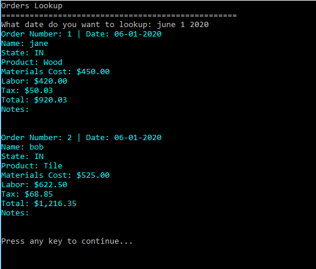

# FlooringOrderingSystem

This application uses visual studio console app to read/write to a file, information about an Order for selling Flooring products.

# Images

The above image is the main menu that gives you four option to select from.

The above image is the Display Order option that lets you look up order(s) from a file. At the moment, the only files that exist are the dates June 1 2013, June 1 2019, June 1 2020, and June 1 2025.

The above image shows the input information needed to write to a file.

The above information ask for confirmation on adding the order.

